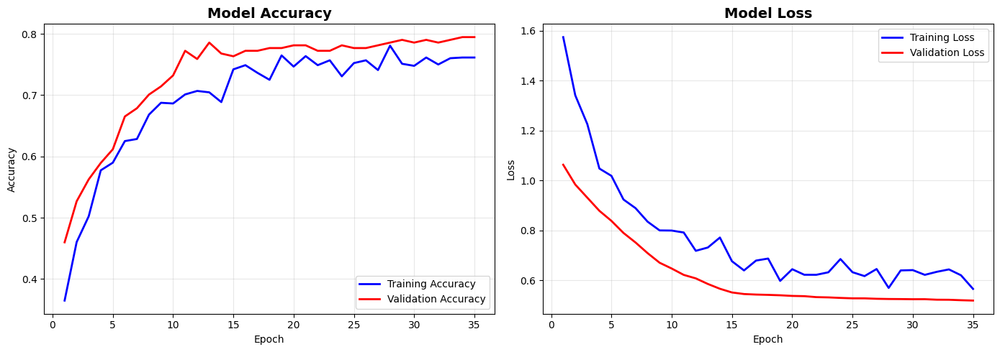

# EP_4--Deep_Learning

Trabalho desenvolvido em python, referente a classificação de imagens, para a matéria de Inteligência Artificial ministrada pelo professor Celso Crivelaro

[Apresentação Slide](https://www.canva.com/design/DAGpaJAyDg8/ncygOLWZCSlVMHPXCV7GCw/edit?utm_content=DAGpaJAyDg8&utm_campaign=designshare&utm_medium=link2&utm_source=sharebutton)
[Bot Classificação](https://discord.gg/7d2AVQXK) (Ultilizar !classificar + img)

# Classificador de Imagens CNN utilizando EfficientNetB0

Visão Geral
O código implementa um classificador de imagens de animes usando transferência de aprendizado com EfficientNetB0 pré-treinada (ImageNet), dividido em duas fases: treinamento com base congelada e fine-tuning (ajuste fino). Utiliza data augmentation, class weights para classes desbalanceadas, métricas avançadas (accuracy, precision, recall, F1) e apresenta relatório final com matriz de confusão.

## Por que utilizar EfficientNetB0?

Escolhemos EfficientNetB0 neste projeto porque, embora MobileNetV2 seja muito eficiente e leve, EfficientNetB0 proporciona uma **combinação superior de eficiência e acurácia**, sendo mais indicado para tarefas que exigem diferenciação mais refinada entre classes semelhantes, mesmo em datasets pequenos. Comparando com MobileNetV2, entrega uma acurácia mais alta em tarefas de classificação de imagens com custo computacional similar.

### Principais Pontos Positivos

- Utiliza EfficientNetB0, arquitetura eficiente para classificação
- Aplicação correta de data augmentation.
- Implementa class weights para lidar com desbalanceamento.
- Estratégia de duas fases para aproveitar pré-treinamento.
- Monitoramento com callbacks robustos (early stopping, reduce LR, checkpoint).
- Relatórios e visualizações claras para análise de desempenho.

---

# Introdução da análise

Foram realizados diversos testes utilizando diferentes quantidades de classes no dataset, começando com 16, depois 10, posteriormente 4 e, por fim, apenas 3 classes. Ao longo desses experimentos, foram identificados vários problemas nos resultados e modelos, incluindo casos de overfitting. Por último, foi feita uma análise comparativa entre os cenários com 4 classes (sendo uma delas desbalanceada, com menos imagens) e com 3 classes (todas balanceadas), destacando o impacto do balanceamento no desempenho do modelo.

# Análise Comparativa de Desempenho: 4 Classes vs 3 Classes

## Resultados Obtidos

| Métrica   | 4 Classes | 3 Classes | Variação    |
| --------- | --------- | --------- | ----------- |
| Acurácia  | 75.17%    | 79.82%    | **+4.65%**  |
| Precision | 81.47%    | 82.86%    | +1.39%      |
| Recall    | 66.08%    | 76.32%    | **+10.24%** |
| F1-Score  | 72.97%    | 79.45%    | **+6.48%**  |

---

## Evolução durante treinamento

---

## Matriz de Confusão

- **4 Classes:**  
  Mostrava confusões significativas envolvendo a classe "One Piece" e mais erros entre "Dragon Ball Z" e "Naruto".
- **3 Classes:**  
  As taxas de acerto por classe subiram, principalmente para "My Hero Academia" e "Naruto".
  - Por exemplo: "My Hero Academia" teve 88,2% de acertos, e "Naruto" 81,6%.

---

## 

## Principais Impactos da Remoção da Classe "One Piece"

### 1. **Problema Mais Simples**

- O modelo agora só precisa distinguir entre 3 classes em vez de 4.
- Menos possibilidades de erro, maior chance de acerto nas predições.

### 2. **Classes Balanceadas**

- Com a remoção, as três classes ficaram exatamente balanceadas (380 imagens cada).
- Isso melhora o aprendizado e evita viés para alguma classe.

### 3. **Menos Confusões**

- A classe "One Piece" era a com menor número de acertos e mais confusões na matriz anterior.
- Sua remoção eliminou uma fonte importante de erro, facilitando a separação das demais.

### 4. **Melhora Estatística nas Métricas**

- Como há menos classes, o impacto de cada erro é menor nas métricas globais.
- O recall e o F1-Score foram os mais beneficiados, refletindo melhor capacidade do modelo em recuperar exemplos corretos.

---

## Resumo

- Remover a classe "One Piece" facilitou consideravelmente a tarefa do classificador.\*\*
- Houve **melhora em todas as métricas**, principalmente recall e F1-Score.
- Isso não indica que o modelo ficou “mais inteligente”, mas sim que o problema ficou mais fácil.

> ### Conclusão
>
> Para aplicações reais, o ideal seria aumentar a base de "One Piece" e melhorar o dataset ao invés de simplesmente remover classes difíceis. Porém essa ação de aumentar a base deveria ser aplicada a todas as classes para que assim o desempenho do modelo se sobresaísse.

---

#### Referencia

RIYADI, S.; MULYA, R.; NABILA REALISTI, A. Comparison of MobilenetV2 and EfficiennetB3 Method to Classify Diseases on Corn Leaves. E3S Web of Conferences, v. 595, p. 02006, 2024.

TEAM, K. Keras documentation: Image classification via fine-tuning with EfficientNet. Disponível em: <https://keras.io/examples/vision/image_classification_efficientnet_fine_tuning/>.
